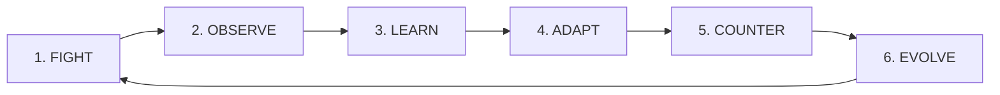

# PLAYNEXUS

<div align="center">

[](https://react.dev/)
[](https://www.typescriptlang.org/)
[](https://threejs.org/)
[](https://vitejs.dev/)
[](https://tailwindcss.com/)
[](https://expressjs.com/)

### *THE AI THAT LEARNS HOW YOU FIGHT.*
**Fight. Learn. Adapt. Dominate.**

</div>

---

**PLAYNEXUS** is a next-generation cyberpunk 3D fighting experience built for the CodeMania hackathon. An adaptive neural AI opponent observes your combat behavior in real time, computes your unique **Fighting DNA** profile across five biometric pillars, and dynamically deploys punishing counter-strategies to break your combat habits.

---

## ⚡ Core Loop



$$\text{FIGHT} \longrightarrow \text{OBSERVE} \longrightarrow \text{LEARN} \longrightarrow \text{ADAPT} \longrightarrow \text{COUNTER} \longrightarrow \text{EVOLVE}$$

---

## 🌟 Key Features

### 🧠 Real-Time Adaptive AI & Fighting DNA Engine
- **5 Behavioral Pillars**: Continuously measures **Aggression**, **Defense**, **Mobility**, **Predictability**, and **Reaction Speed**.
- **Combat Archetype Classification**: Automatically identifies playstyles: `BERSERKER`, `TURTLE`, `PHANTOM`, `TACTICIAN`, or `BALANCED_STRIKER`.
- **Dynamic Counter-Strategies**: AI detects tactical weaknesses (e.g. repeated left-dodge bias, predictable combo chains) and adjusts its flank sweeping, guard timing, and approach velocity.

### 🔒 In-Combat Dodge Lock Challenges
- Triggers dynamic in-match adaptation locks when severe habit bias is detected (e.g. *"PATTERN DETECTED: 83% OF DODGES ARE LEFT — SURVIVE 15s DODGING ONLY RIGHT"*).
- Successfully breaking habits rewards the player with instant agility buffs and permanent adaptation score gains.

### 📷 AI Camera Weapon Scanner & Synthesis
- Point your device camera at real-world items (e.g., Book, Phone, Water Bottle, Pen) to synthesize unique cybernetic weapons with stat bonuses, rarity tiers, and custom lore.

### 🎙️ Voice-Activated Combat Commands
- Real-time speech recognition engine allowing hands-free voice trigger for attacks, blocks, evasive dodges, and special moves.

### 🏟️ Grand 3D Cyberpunk Arena
- Powered by **Three.js** and **React Three Fiber**.
- Dynamic stadium architecture, glowing neon rings, volumetric dust particles, shadow mapping, and responsive third-person camera dynamics.

### 📊 Post-Match Battle Intelligence Dashboard
- Interactive radar charts, biometric breakdown, habit analysis, and shareable combat reports.

### 🏆 Global Leaderboard & Player Progression
- Ranked competitive ladder tracking combat ratings, win streaks, and player DNA profiles.

### 🎬 Hackathon Interactive Demo Mode
- Integrated one-click presentation control bar (`/demo`) for live stage demonstrations.

---

## 🛠️ Technology Stack

| Layer | Technologies |
| :--- | :--- |
| **Frontend UI** | React 19, TypeScript, Vite 8, React Router v7 |
| **3D Rendering** | Three.js, React Three Fiber (`@react-three/fiber`), Drei (`@react-three/drei`) |
| **State Management** | Zustand |
| **Styling & FX** | Vanilla CSS, Tailwind CSS v4, Framer Motion, Canvas Confetti, Lucide Icons |
| **AI & Multimodal** | Web Speech API (Voice), WebRTC / MediaStream API (Camera Scanner) |
| **Backend API** | Node.js, Express, MongoDB / Mongoose, CORS |

---

## 🎮 Combat Controls

| Action | Keyboard | Voice Command | Gamepad / Touch |
| :--- | :---: | :---: | :---: |
| **Move** | <kbd>W</kbd> <kbd>A</kbd> <kbd>S</kbd> <kbd>D</kbd> | — | Virtual Joystick |
| **Light / Combo Strike** | <kbd>J</kbd> | *"Attack"* / *"Strike"* | Strike Button |
| **Guard / Block** | <kbd>K</kbd> *(Hold)* | *"Block"* / *"Guard"* | Block Button |
| **Special Strike** | <kbd>U</kbd> / <kbd>L</kbd> | *"Special"* / *"Power"* | Special Button |
| **Evasive Dodge** | <kbd>SPACE</kbd> | *"Dodge"* / *"Evade"* | Dodge Button |
| **Voice Toggle** | <kbd>V</kbd> | — | Mic Icon |

---

## 🗺️ Application Architecture

```
PlayNexus/
├── backend/                     # Node.js & Express REST Backend
│   ├── src/
│   │   ├── config/              # Database connection configuration
│   │   ├── controllers/         # Match, AI, and Player controllers
│   │   ├── models/              # Mongoose schemas (Player, Match, Opponent)
│   │   ├── routes/              # API route definitions (/api/*)
│   │   ├── services/            # Behavior analysis & AI strategy services
│   │   └── server.js            # Express server entry point
│   └── package.json
│
├── src/                         # Frontend Application
│   ├── ai/                      # Fighting DNA & Adaptive Strategy Engine
│   ├── components/
│   │   ├── 3d/                  # Three.js 3D Arena & Stadium meshes
│   │   ├── ai/                  # Battle Intelligence & Radar analysis views
│   │   ├── game/                # Combat arena, HUD, Health bars, & Overlays
│   │   ├── scanner/             # Camera weapon scanner & synthesis modal
│   │   └── ui/                  # Cyberpunk UI elements & glow controls
│   ├── demo/                    # Hackathon guided presentation suite
│   ├── hooks/                   # Custom hooks (Voice, Sound, Keyboard controls)
│   ├── pages/                   # Application views (Home, Lobby, Arena, Leaderboard)
│   ├── routes/                  # App routing setup
│   ├── store/                   # Zustand stores (Auth, Telemetry, Demo)
│   ├── App.tsx
│   └── main.tsx
│
├── .npmrc                       # Dependency resolution config
└── package.json
```

---

## 🚀 Getting Started

### Prerequisites
- **Node.js**: v18.0.0 or higher
- **npm**: v9.0.0 or higher
- *(Optional)* **MongoDB**: Local instance or MongoDB Atlas connection for persistent telemetry

---

### 1. Frontend Setup

```bash
# 1. Clone the repository
git clone https://github.com/suwarnathakur/PlayNexus.git
cd PlayNexus

# 2. Install dependencies
npm install

# 3. Start local development server
npm run dev
```

Open [http://localhost:5173](http://localhost:5173) in your browser.

---

### 2. Backend Setup (Optional)

```bash
# Navigate to backend directory
cd backend

# Install dependencies
npm install

# Configure environment variables
cp .env.example .env

# Start backend server
npm run dev
```

The backend server runs on [http://localhost:5000](http://localhost:5000).

---

### 3. Production Build & Verification

To verify full TypeScript compilation and create the optimized production bundle:

```bash
npm run build
```

---

## 🏆 Hackathon Presentation Tips

1. **One-Click Quick Login**: Use the Judge quick-access button on the `/login` gateway.
2. **Demo Controller**: Toggle the interactive demo bar via the bottom toggle or Settings to guide judges through the 2-match adaptation loop.
3. **Audio Experience**: Unmute sound in Settings to experience spatial cyber SFX.

---

## 📄 License

This project is licensed under the MIT License.
